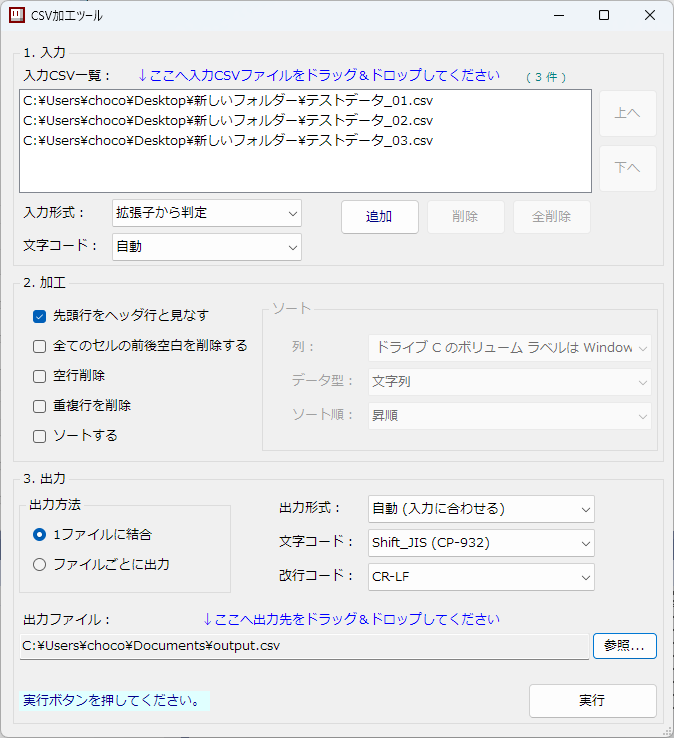

# CSV加工ツール（CSV Bulk Tool）

複数の CSV / TSV ファイルをまとめて整形・変換・結合する Windows デスクトップアプリケーションです。ファイルを登録し、加工内容と出力先を選ぶことで、空白・空行・重複行の削除や並べ替えを一括で行えます。



## エンドユーザー向け

### できること

- 複数の CSV / TSV を、1 ファイルに結合またはファイルごとに加工して出力。
- 各セルの前後の空白、空行、全列の値が一致する重複行を削除。
- 指定した 1 列を文字列または数値として、昇順・降順で並べ替え。
- CSV と TSV の相互変換、文字コード・改行コードの変換。
- ヘッダー名に基づく列の対応付け。列順や列の有無が異なるファイルも結合可能。
- 処理前に入力ファイルを検査し、見つかったエラーを一覧で表示。

たとえば、部門別の売上 CSV を集めて空白や重複を除き、金額順に並べた 1 ファイルを作成できます。複数ファイルの文字コードや改行コードをそろえる用途にも使えます。

### 実行環境

Windows と .NET Framework 4.8 が必要です。アプリケーションは x86（32 ビット）構成です。
実行ファイルと同じフォルダにログなどを作成するため、そのフォルダへの書き込み権限が必要です。

### 基本的な使い方

1. **入力ファイルを追加する**  
   「1. 入力」の一覧にファイルをドラッグ＆ドロップするか、「追加」から選択します。最大 1,000 件まで扱えます。「上へ」「下へ」で処理順を変更できます。
2. **入力形式と文字コードを選ぶ**  
   「拡張子から判定」では `.csv` と `.tsv` を受け付けます。`.txt` などを読み込む場合は、追加前に「全て CSV と見なす」または「全て TSV と見なす」を選びます。
3. **加工内容を選ぶ**  
   先頭行が列名なら「先頭行をヘッダ行と見なす」を有効にします。必要に応じて空白・空行・重複行の削除を選びます。「ソートする」を有効にすると、列・データ型・ソート順を指定できます。
4. **出力方法と出力先を選ぶ**  
   「1ファイルに結合」では出力ファイルを、「ファイルごとに出力」では出力フォルダを「参照...」から指定します。出力形式・文字コード・改行コードも選択します。
5. **「実行」を押す**  
   入力検査後に加工・出力します。既存ファイルを上書きする場合は確認画面が表示されます。検査エラーがある場合は出力を行わず、エラー一覧を表示します。

出力先欄へのドラッグ＆ドロップも利用できます。ファイルをドロップすると結合出力、フォルダをドロップすると個別出力に切り替わります。出力方法を切り替えると出力先欄がクリアされるため、改めて指定してください。

### 文字コード・出力形式の選び方

| 項目 | 選択肢・動作 |
| --- | --- |
| 入力文字コード | 自動、Shift_JIS（CP932）、UTF-8 |
| 入力文字コードの「自動」 | UTF-8 の BOM があれば UTF-8、それ以外は CP932 として読み込み |
| 出力形式 | 自動（入力に合わせる）、CSV、TSV |
| 出力形式の「自動」 | 結合時は一覧の最初の入力形式、個別出力時は各入力形式を使用 |
| 出力文字コード | Shift_JIS（CP932）、UTF-8（BOM あり）、UTF-8（BOM なし） |
| 出力改行コード | CR-LF、LF |

**BOM なしの UTF-8 ファイルは、入力文字コードに「UTF-8」を指定してください。** 「自動」は内容から文字コードを推測する機能ではありません。入力形式・文字コードの設定は一覧内の全ファイルに適用されます。

個別出力のファイル名は、入力ファイルの拡張子を出力形式に合わせた `.csv` または `.tsv` にしたものです。同じ出力ファイル名になる入力が複数ある場合はエラーになります。結合時は指定したファイル名を使用するため、拡張子も出力形式に合わせてください。

### 加工時の動作

- **ヘッダーありの結合**：列名が同じ列を対応付けます。最初のファイルの列順を基準とし、後続ファイルで初めて登場した列を末尾に追加します。存在しない列の値は空欄になります。ヘッダーは出力の先頭に 1 回だけ書き込みます。
- **ヘッダーなし**：先頭行もデータとして扱い、列は位置で扱います。ソート列は「1 列目」などの表示になります。
- **空白・空行の削除**：前後の空白削除を行ってから、全セルが空の行を削除します。空白だけのセルも空にしたい場合は、両方を有効にしてください。
- **重複削除・ソート**：結合時は結合後の全データ、個別出力時はファイルごとのデータが対象です。ソートしない場合は入力一覧と各ファイル内の行順で処理します。
- **数値ソート**：小数点は `.` を使います。空欄は昇順で数値より前、降順で後に並びます。数値として解釈できない値はエラーになります。

CSV / TSV の引用符で囲まれたセル、セル内の区切り文字・改行、二重引用符のエスケープに対応しています。

### エラーを確認するには

入力検査では、不正な文字コード・引用符・制御文字、空または重複したヘッダー名、ヘッダーより多いデータ列、同一入力ファイルの重複、出力文字コードで表現できない文字などを検出します。ヘッダー名の大文字と小文字は区別されます。

通常セルでは CR・LF・TAB 以外の制御文字を許可せず、ヘッダーではすべての制御文字を許可しません。

実行時には、実行ファイルと同じ場所に `<実行ファイル名>.log` と `<実行ファイル名>.error.log` を作成します。ログは実行のたびに上書きされます。

## プログラマ向け

### 技術構成とソースの入口

本体は `MainProgram/` にあります。C# / Windows Forms / .NET Framework 4.8 を使用し、ソリューションには `HLTForm` プロジェクトが 1 つ含まれます。名前空間は `HLTStudio` です。プロジェクトの参照は .NET Framework の標準アセンブリで構成されています。

| パス | 役割 |
| --- | --- |
| [MainProgram/HLTForm/HLTForm.sln](MainProgram/HLTForm/HLTForm.sln) | 本体のソリューション |
| [Program.cs](MainProgram/HLTForm/HLTForm/Program.cs) / [GUIProcMain.cs](MainProgram/HLTForm/HLTForm/GUIProcMain.cs) | エントリポイント、GUI 起動、例外処理、多重起動の制御 |
| [MainWin.cs](MainProgram/HLTForm/HLTForm/MainWin.cs) | 入出力設定、ファイル一覧、イベント処理、処理エンジンへの設定引き渡し |
| [MainWin.Designer.cs](MainProgram/HLTForm/HLTForm/MainWin.Designer.cs) | メイン画面のコントロール配置 |
| [Modules/CSVProcessor.cs](MainProgram/HLTForm/HLTForm/Modules/CSVProcessor.cs) | 入力検査、出力計画、列の対応付け、加工、出力の確定 |
| [Tools/CsvFileReader.cs](MainProgram/HLTForm/HLTForm/Tools/CsvFileReader.cs) | 厳密な文字コード検証と CSV / TSV の解析 |
| [Tools/CsvFileWriter.cs](MainProgram/HLTForm/HLTForm/Tools/CsvFileWriter.cs) | 引用符のエスケープ、文字コード・改行コードを指定した書き込み |
| [Dialogs/ProcessingDlg.cs](MainProgram/HLTForm/HLTForm/Dialogs/ProcessingDlg.cs) | ワーカースレッドでの実行と処理中ダイアログ |
| [Dialogs/ErrorLogDlg.cs](MainProgram/HLTForm/HLTForm/Dialogs/ErrorLogDlg.cs) / [Dialogs/MessageDlg.cs](MainProgram/HLTForm/HLTForm/Dialogs/MessageDlg.cs) | 検査エラー一覧、確認・結果表示 |
| [Consts.cs](MainProgram/HLTForm/HLTForm/Consts.cs) / `Commons/` | アプリ名・入力数上限などの定数、共通処理 |

[MainProgram/spec/CsvBulkTool_spec.md](MainProgram/spec/CsvBulkTool_spec.md) は設計時の仕様書です。候補や未確定事項を含むため、現在の動作は実装と照らして確認してください。たとえば、実装のソート型は文字列と数値で、ヘッダー付き結合では異なる列構成を列名で統合します。

### 処理の流れ

`MainWin.Btn実行_Click` が画面の設定を `CSVProcessor` に渡し、`RunWithDialog` → `Run` → `RunCore` の順で処理します。

1. **事前検査（`Precheck` / `Inspect`）**  
   各入力を読み取り、形式・文字コード・ヘッダー・数値ソートの値・出力文字コードへの変換可否などを検査します。ファイル単位でエラーを収集し、他のファイルの検査も続けます。
2. **出力計画（`PlanOutputs`）**  
   結合／個別出力のパス、区切り文字、統合ヘッダーを決定します。出力名の衝突や出力フォルダ、既存出力ファイルへの書き込み可否などを検査します。検査エラーがあればここで中止します。
3. **上書き確認**  
   GUI からの実行では既存出力の件数を確認画面に表示します。UI スレッドへの通知には `SynchronizationContext.Send` を使用します。
4. **読み直しと加工（`ReadRows` / `WriteOutput`）**  
   入力のサイズ・更新時刻を検査時と比較してから読み直します。前後空白削除 → 空行削除 → ヘッダーによる列の対応付け → 重複削除 → ソートの順に適用し、一時ファイルへ書き込みます。
5. **出力の確定（`Publish`）**  
   全出力の一時ファイルを作成してから、既存ファイルはバックアップ付きの `File.Replace`、新規ファイルは `File.Move` で確定します。確定途中の失敗時は、確定済み出力を逆順に復元します。復元にも失敗した場合は、その出力先とバックアップのパスをエラーに含めます。

一時ファイルとバックアップは出力先と同じフォルダに作成します。この方式は処理失敗時の復元を目的としており、複数ファイル全体を OS レベルで一括確定するものではありません。

### 実装上のポイント

- `CsvFileReader` は区切り文字で単純に分割せず、引用符の状態を追ってレコードを読み取ります。独自の `StrictTextReader` が EOF でもデコーダーをフラッシュし、末尾の未完結バイト列も検出します。
- 文字列ソート・ヘッダー比較・重複行比較は `Ordinal` に基づきます。数値ソートは `decimal.TryParse`、`NumberStyles.Float`、`InvariantCulture` を使用します。
- ヘッダーありでは不足セルを空文字列に補います。ヘッダーなしでは行ごとの列数を保持し、ソート対象の欠けたセルは空値として扱います。
- ソートなしでは行を逐次処理します。重複削除は既出の行を保持し、ソートは対象行をメモリに保持するため、大量データではメモリ使用量が増えます。
- `CSVProcessor` は加工処理に加え、ソート列候補の更新やダイアログ呼び出しも担当します。UI との連携を含めて読む場合は `MainWin.cs` と併せて確認してください。
- コンボボックスの選択インデックスを列挙値へ変換して設定しています。選択肢を追加・並べ替える際は、`MainWin` と `CSVProcessor` の列挙値の対応も確認してください。

### 開発環境とテストビルド

開発環境は Visual Studio Community 2022 です。.NET Framework 4.8 を対象とする Windows Forms プロジェクトをビルドできる環境を用意してください。

テストビルドは [AGENTS_HowToTestBuild.md](MainProgram/HLTForm/AGENTS_HowToTestBuild.md) に従い、`MainProgram/HLTForm/` をカレントディレクトリにして `TestBuild.bat` を実行します。リポジトリのルートから PowerShell で実行する例です。

```powershell
Set-Location .\MainProgram\HLTForm
.\TestBuild.bat
```

構成は `Debug | x86`、出力先は `MainProgram/HLTForm/HLTForm/bin/Debug/HLTForm.exe` です。バッチは Visual Studio Community 2022 の標準インストール先を参照します。テストビルドでは `dotnet build` や `MSBuild` の直接実行に置き換えず、このバッチを使用してください。

開発時は [AGENTS.md](AGENTS.md) の方針に従い、既存の構成・命名規則を維持してください。`.cs` / `.md` は UTF-8 with BOM・CRLF、`.txt` / `.bat` は CP932・CRLF を使用します。

### インストーラについて

`Installer/` は本アプリケーションのインストーラです。本体の機能と実装は `MainProgram/` を参照してください。
